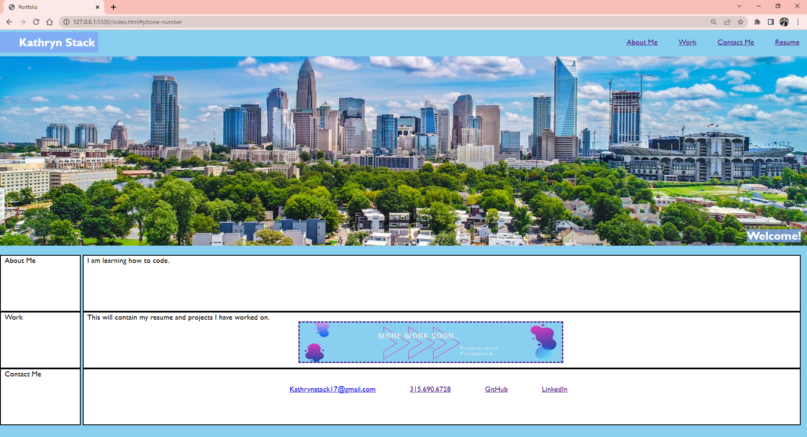

# Portfolio

## Description

My motivation for creating this Portfolio website was to not only practice the HTML and CSS skills I have been learning, but to create rough-draft version of the actual portfolio I would like to show future employers.
I built this project to apply the knowledge I have gained in HTML and CSS to create a  functional and professional portfolio that others can view, and see what work I have done.
This project solved the problem of me not having a platform to showcase the work I have and will do.
I learned that I have a lot more to learn in HTML and CSS and that Google is a very helpful source when trying to problem solve code.

## Screenshot

## Link to deployed site

[Deployed Porfolio](https://kathrynstack.github.io/Portfolio/)

## Table of Contents (Optional)

N/A

## License

N/A

